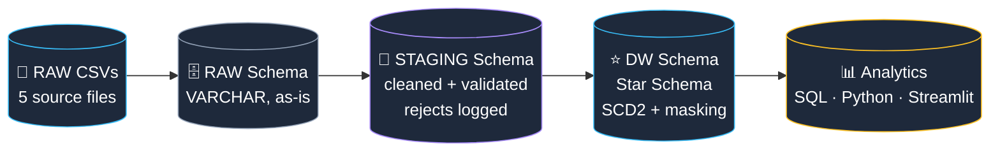
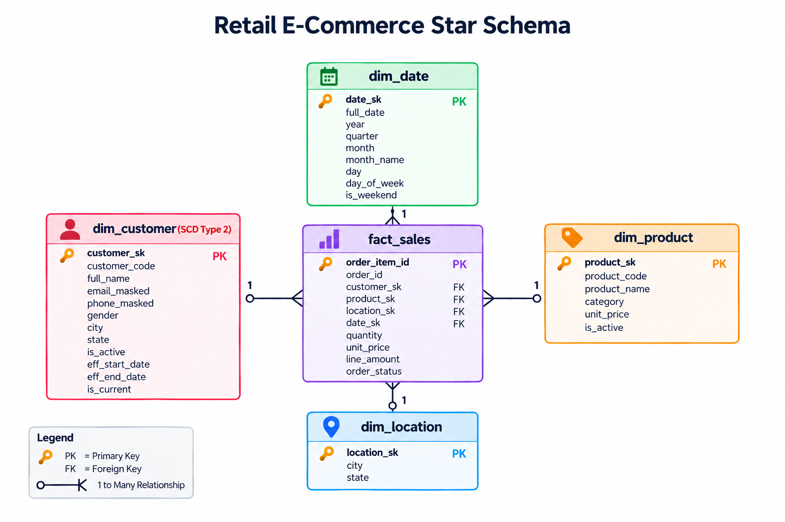
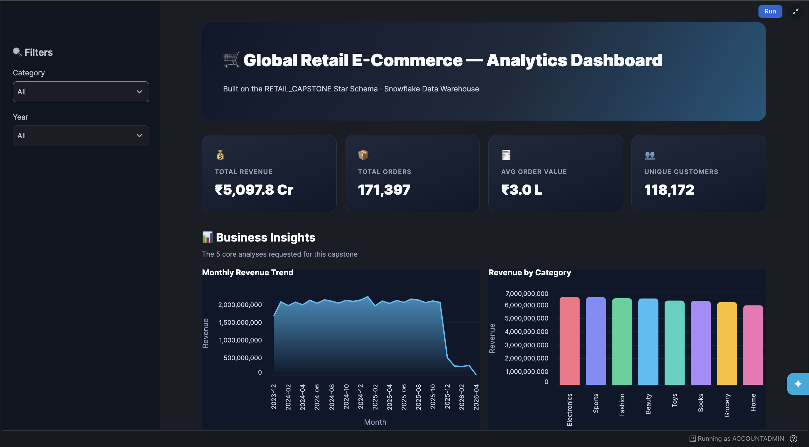
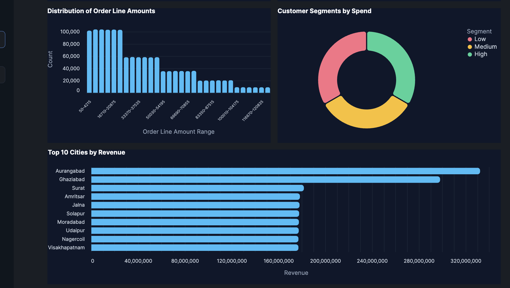
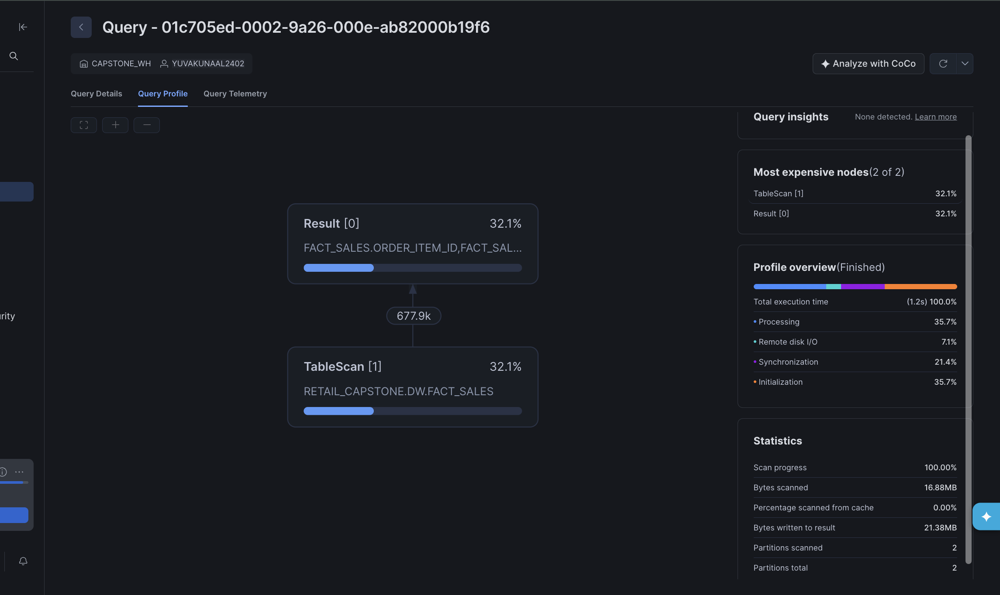

<div align="center">

# 🛒 Global Retail E-Commerce — Data Warehouse & Analytics

**An end-to-end Data Engineering project: raw, deliberately messy OLTP extracts → a validated Star Schema data warehouse → live analytics — built entirely on Snowflake.**

[](https://www.snowflake.com/)
[](#)
[](#)
[](#)
[](#)

[Overview](#-overview) •
[Architecture](#-architecture) •
[Star Schema](#-star-schema) •
[Data Quality](#-data-quality--validation) •
[Setup](#-setup--reproduction) •
[Dashboard](#-live-dashboard) •
[Repo Structure](#-repository-structure)

</div>

---

## 📖 Overview

A global retail e-commerce company needs a centralized Data Warehouse to reliably measure revenue, customer value, and product performance — instead of querying fragmented, inconsistent operational tables.

This project ingests **five OLTP-style CSV extracts (~1.4M rows, ~200K deliberately dirty)** and transforms them into an analytics-ready **Star Schema**, implementing every core pattern of a production data pipeline:

| Capability | Implementation |
|---|---|
| 🏗️ **Dimensional Modelling** | Star Schema — 4 conformed dimensions + 1 fact table |
| 🔄 **ETL** | Both **Full Load** and **Incremental Load** (watermark-driven) |
| 🕰️ **Slowly Changing Dimensions** | **SCD Type 2** on `DIM_CUSTOMER` — full history preserved |
| 🔐 **Data Governance** | PII masking (email/phone) + structured, per-row error logging |
| ✅ **Data Quality** | Every rejection validated against the dataset's own ground-truth profile |
| 📊 **Analytics** | Python (Snowpark + pandas + seaborn) and a live Streamlit dashboard |
| ⚡ **Performance** | Clustering keys + native Query Profile analysis |

---

## 🏗️ Architecture



Every row is **typed, cleaned, and reconciled** before it ever reaches a chart — nothing is silently dropped, and every transformation is reproducible from the SQL scripts in this repo.

---

## 📦 Source Data

| Entity | Source File | Rows | Description |
|---|---|---:|---|
| Customers | `customers_merged.csv` | 244,000 | Customer master records |
| Products | `products_merged.csv` | 15,000 | Product catalog |
| Orders | `orders_merged.csv` | 205,000 | Order headers |
| Order Items | `order_items_merged.csv` | 798,000 | Order line-item detail |
| Payments | `payments_merged.csv` | 138,000 | Payment transactions |
| **Total** | — | **≈1.4M** | **~1.2M clean + ~200K intentionally imperfect (14%)** |

Each source file deliberately blends valid rows with **six categories of realistic data-quality issues** — missing values, negative numbers, future dates, duplicate keys, orphaned foreign keys (`__ORPHAN__` sentinel), and type mismatches — to simulate genuine operational data.

---

## ⭐ Star Schema

<div align="center">

</div>

| Table | Type | Notes |
|---|---|---|
| `FACT_SALES` | Fact | Grain: **one row per order item** — `quantity`, `unit_price`, `line_amount`, `order_status` |
| `DIM_CUSTOMER` | Dimension | **SCD Type 2** — tracks city/email/phone history via `eff_start_date`, `eff_end_date`, `is_current`; email & phone masked |
| `DIM_PRODUCT` | Dimension | Type 1 (overwrite) — product name, category, price |
| `DIM_DATE` | Dimension | Calendar hierarchy — day → month → quarter → year |
| `DIM_LOCATION` | Dimension | Unique city/state combinations observed across orders |

<details>
<summary><strong>📐 View the DDL for <code>FACT_SALES</code></strong></summary>

```sql
CREATE OR REPLACE TABLE FACT_SALES (
  order_item_id STRING,
  order_id      STRING,
  customer_sk   NUMBER,
  product_sk    NUMBER,
  location_sk   NUMBER,
  date_sk       NUMBER,
  quantity      NUMBER,
  unit_price    NUMBER(18,2),
  line_amount   NUMBER(18,2),
  order_status  STRING
);
```
</details>

---

## ✅ Data Quality & Validation

Rather than assuming the cleaning logic worked, every `*_CLEAN` / `*_ERRORS` split was **validated against the dataset generator's own ground-truth `profiling_summary.json`** — the exact count of bad rows intentionally planted per table.

| Table | Planted (Ground Truth) | Detected (Final Pipeline) | Result |
|---|---:|---:|---|
| Orders | 30,000 | 30,000 | ✅ Exact match |
| Order Items | 118,000 | 118,000 | ✅ Exact match |
| Payments | 20,000 | 20,000 | ✅ Exact match |
| Products | 3,000 | 3,038 | ✅ ~99% match |
| Customers | 29,000 | 23,422 | ⚠️ Explained gap — see note |

> **Why Customers shows a gap:** the remaining difference is a *time-decay effect*, not a logic error. Dates injected as "future" relative to the dataset's original generation time have since elapsed — they're no longer detectable as "future" when validated today. This was diagnosed and confirmed by tracing the actual generator script, not assumed.

<details>
<summary><strong>🔎 View the core row-flagging logic (<code>04_full_load_staging.sql</code>)</strong></summary>

```sql
CREATE OR REPLACE TEMPORARY TABLE _customers_flagged AS
SELECT *,
    ROW_NUMBER() OVER (PARTITION BY customer_code ORDER BY updated_at) AS rn,
    CASE
        WHEN customer_code IS NULL THEN 'missing_customer_code'
        WHEN city IS NULL OR TRIM(city) = '' THEN 'missing_city'
        WHEN email IS NULL OR TRIM(email) = '' THEN 'missing_email'
        WHEN phone IS NOT NULL AND NOT REGEXP_LIKE(phone,'.*[0-9].*')
             THEN 'phone_type_mismatch'
        WHEN TRY_TO_TIMESTAMP(updated_at) > CURRENT_TIMESTAMP()
             THEN 'future_updated_at'
        ELSE NULL
    END AS reject_reason
FROM RAW.CUSTOMERS_RAW;
```

Every row gets a specific, human-readable rejection reason — nothing is silently dropped. Clean, first-occurrence rows go to `*_CLEAN`; everything else goes to `*_ERRORS` with its exact reason.
</details>

---

## 🔄 ETL — Full Load & Incremental Load

Both patterns are implemented and demonstrated live, not just described:

<table>
<tr>
<th>Full Load</th>
<th>Incremental Load</th>
</tr>
<tr>
<td valign="top">

- Truncates and reloads STAGING + DW from RAW
- Simple, deterministic — baseline for initial population
- Used for `DIM_PRODUCT`, `DIM_LOCATION` (Type 1)

</td>
<td valign="top">

- A `LOAD_WATERMARKS` table tracks last-processed timestamp
- Only rows newer than the watermark are extracted
- Proven with a simulated new order (`08_incremental_load.sql`)

</td>
</tr>
</table>

<details>
<summary><strong>⏱️ View the incremental watermark logic</strong></summary>

```sql
CREATE OR REPLACE TABLE LOAD_WATERMARKS (
  table_name STRING, last_loaded_at TIMESTAMP
);

-- Only pull rows newer than the last successful run
INSERT INTO STAGING.ORDERS_CLEAN
SELECT order_id, customer_code, TRY_TO_TIMESTAMP(order_date),
       status, order_city, order_state
FROM RAW.ORDERS_RAW
WHERE customer_code <> '__ORPHAN__'
  AND TRY_TO_TIMESTAMP(order_date) >
      (SELECT last_loaded_at FROM LOAD_WATERMARKS WHERE table_name='ORDERS');

-- Advance the watermark after a successful run
UPDATE LOAD_WATERMARKS SET last_loaded_at = CURRENT_TIMESTAMP()
WHERE table_name = 'ORDERS';
```
</details>

---

## 🕰️ SCD Type 2 — Historical Tracking

When a tracked attribute changes (city, email, or phone), the existing `DIM_CUSTOMER` row is **expired, never overwritten**, and a fresh current row is inserted — preserving accurate historical attribution.

| customer_code | city | is_current | eff_end_date |
|---|---|---|---|
| C0009857 | Mumbai | `FALSE` | 2026-09-12 |
| C0009857 | Delhi | `TRUE` | `NULL` |

<details>
<summary><strong>🔁 View the expire + insert SQL (<code>07_scd2_customer.sql</code>)</strong></summary>

```sql
-- Step A: expire the OLD version if city/email/phone changed
UPDATE DW.DIM_CUSTOMER dc
SET eff_end_date = CURRENT_TIMESTAMP(), is_current = FALSE
FROM STAGING.CUSTOMERS_CLEAN sc
WHERE dc.customer_code = sc.customer_code
  AND dc.is_current = TRUE
  AND (dc.city <> sc.city OR dc.email_masked <> ... );

-- Step B: insert the NEW version as current
INSERT INTO DW.DIM_CUSTOMER (..., eff_start_date, eff_end_date, is_current)
SELECT sc.*, CURRENT_TIMESTAMP(), NULL, TRUE
FROM STAGING.CUSTOMERS_CLEAN sc
LEFT JOIN DW.DIM_CUSTOMER dc
  ON sc.customer_code = dc.customer_code AND dc.is_current = TRUE
WHERE dc.customer_code IS NULL;  -- new, or just expired above
```
</details>

---

## 🔐 Governance: Masking & Error Logging

| Feature | Detail |
|---|---|
| **PII Masking** | `email_masked`, `phone_masked` replace raw values in `DIM_CUSTOMER` — unmasked data never leaves `STAGING` |
| **Error Logging** | Every rejected row is preserved in a dedicated `*_ERRORS` table with its exact reason (`orphan_customer`, `negative_quantity`, `duplicate_payment_id`, etc.) |

```
priya.sharma@example.com   →   p***a@example.com
+91 98765 43210             →   ***********3210
```

---

## 📊 Live Dashboard

An interactive **Streamlit-in-Snowflake** app — Snowpark pulls DW tables directly into pandas; filters update every KPI and chart in real time, no external BI tool required.

<div align="center">

<br><br>

</div>

All **5 required chart types** — line, bar, histogram, donut, and horizontal bar — are delivered twice: once as seaborn charts in the Snowpark notebook, and once as live, hoverable Altair charts in the dashboard.

---

## ⚡ Performance Optimization

```sql
ALTER TABLE DW.FACT_SALES CLUSTER BY (date_sk);
```

Most analytical queries filter or group by date — clustering lets Snowflake's micro-partition pruning skip irrelevant blocks instead of scanning the full table.

<div align="center">

</div>

| Metric | Value |
|---|---|
| Execution time | 1.2s |
| Bytes scanned | 16.88 MB |
| Partitions scanned | 2 |
| Query insights flagged | 0 |

---

## 🗂 Repository Structure

```
DA-Project-Team-7/
├── RawDataset/                  # Original 5 source CSVs (~1.4M rows)
│   ├── customers_merged.csv
│   ├── products_merged.csv
│   ├── orders_merged.csv
│   ├── order_items_merged.csv
│   └── payments_merged.csv
│
├── CleanDataset/                 # Final exported DW tables (post full ETL)
│   ├── dim_customer.csv          # 220,579 rows
│   ├── dim_product.csv           # 11,963 rows
│   ├── dim_date.csv              # 3,000 rows
│   ├── dim_location.csv          # 8,848 rows
│   └── fact_sales.csv            # 677,942 rows
│
├── SF-CODE/                       # All SQL, run in numeric order
│   ├── 00_setup.sql               # Database, schemas, warehouse, stage
│   ├── 00_fix_columns.sql
│   ├── 00_streamlit_network_access.sql
│   ├── 01_explore.sql             # Day 1 — data profiling
│   ├── 02_analysis.sql            # Day 1 — analytical SQL
│   ├── 03_staging_ddl.sql
│   ├── 04_full_load_staging.sql   # Row-level flag → clean/error split
│   ├── 05_dw_ddl.sql              # Star Schema table definitions
│   ├── 06_dw_dml.sql              # Full Load into DW
│   ├── 07_scd2_customer.sql       # SCD Type 2 expire + insert
│   ├── 08_incremental_load.sql    # Watermark-driven incremental load
│   └── 09_validation_check.sql    # Ground-truth reconciliation
│
├── PY-Code/
│   ├── retail_project_analysis.ipynb   # Snowpark + pandas + seaborn
│   └── streamlit_app.py                 # Live dashboard (Altair)
│
├── assets/                        # Diagrams & screenshots (for this README)
|     ├── schema.png                     # Star schema diagram
└── README.md
```

---

## 🚀 Setup & Reproduction

Run the SQL scripts in `SF-CODE/` **in numeric order** inside Snowsight worksheets:

1. **`00_setup.sql`** — creates the database, schemas, warehouse, and internal stage
2. **Upload the 5 CSVs** from `RawDataset/` into `RAW.*` tables (load every column as `VARCHAR`)
3. **`00_fix_columns.sql`** — renames auto-generated columns if the upload wizard didn't detect headers
4. **`01_explore.sql` → `02_analysis.sql`** — Day 1 data profiling and analytical SQL
5. **`03_staging_ddl.sql` → `04_full_load_staging.sql`** — builds and populates the cleaned STAGING layer
6. **`05_dw_ddl.sql` → `06_dw_dml.sql`** — builds and populates the DW Star Schema
7. **`07_scd2_customer.sql`** — SCD Type 2 demo (simulate a customer change, verify history is preserved)
8. **`08_incremental_load.sql`** — incremental load demo using a watermark table
9. **`09_validation_check.sql`** — validates cleaned counts against ground truth

Then open `PY-Code/retail_project_analysis.ipynb` as a **Snowflake Notebook**, or deploy `PY-Code/streamlit_app.py` as a **Streamlit-in-Snowflake** app — both pointed at `RETAIL_project.DW`.

> **Prerequisites:** a Snowflake account (trial works fine), `ACCOUNTADMIN` or equivalent role, and an `XSMALL` warehouse is sufficient for this data volume.

---

## 🧰 Tech Stack


---

## 👥 Team

**Team 7 — DA Project**

---

<div align="center">

*Built as a 3-day sprint-based Data Engineering project — every number in this README is pulled from validated SQL execution, not assumed.*

</div>